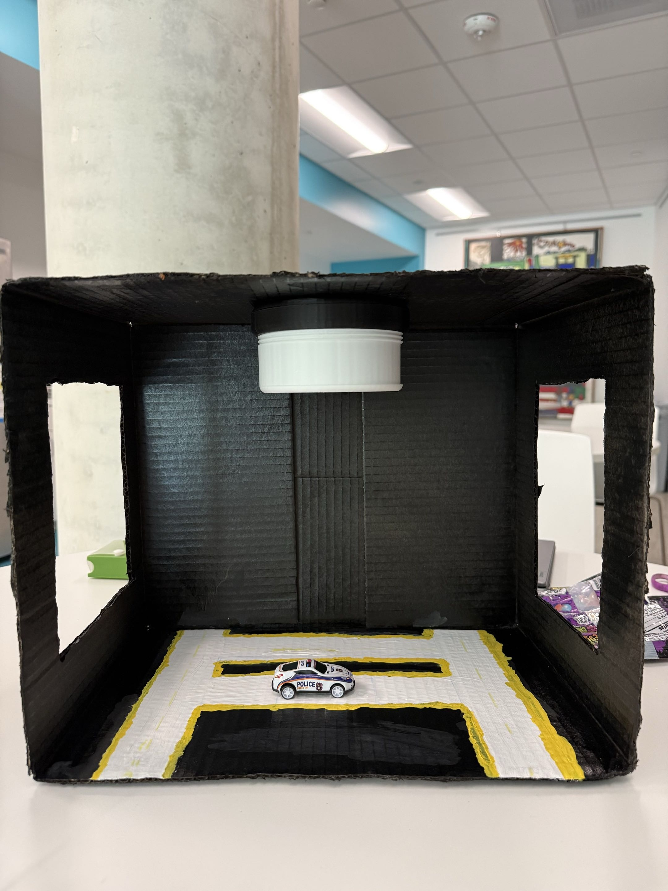
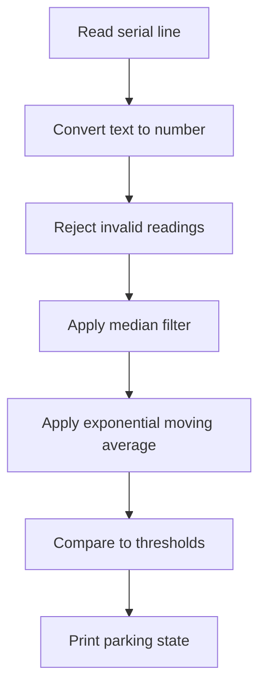
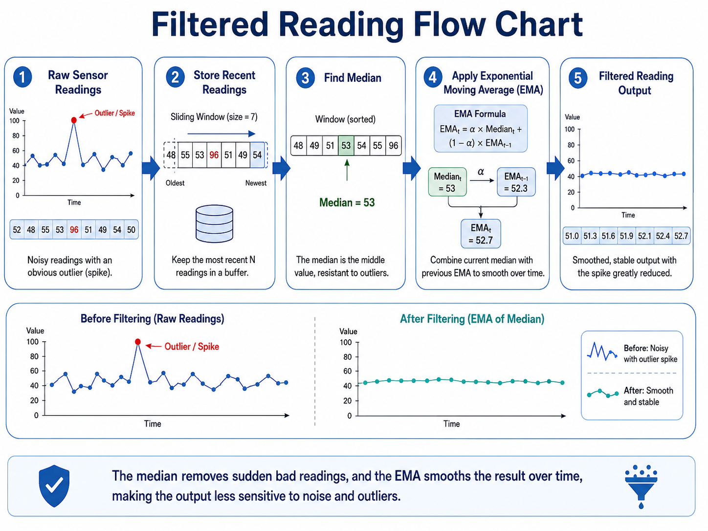

# Mini Project #3: Smart Parking Sensor Data Processing with ESP32 and Python

**Anthony Huynh — ECE 196 SP26**

---

## Abstract

This tutorial breaks down the logic behind signal processing to build a simple smart parking spot detector using an ESP32 Dev board, a VL53L1X time-of-flight distance sensor, Arduino firmware, and Python signal processing. Logistically,the ESP32 reads distance values from the sensor and sends them to a computer over USB serial. Python then filters the noisy sensor data and decides whether a parking spot is **EMPTY** or **OCCUPIED**. This tutorial connects to concepts from **ECE 101**, especially discrete-time signal processing, filtering, thresholds, and noise reduction.

---

## Project Photo Placeholder

```md

```

> **Description to add:** Sensor and ESP32 are located at the top. 

---

## 1. Tutorial Goal

The goal of this tutorial is to teach how raw sensor readings can be converted into a reliable parking spot decision. A single sensor reading can be noisy, so this project uses simple digital signal processing ideas to clean up the readings before making a decision. 

By the end of this tutorial, you should be able to:

- Connect a VL53L1X distance sensor to an ESP32 using I2C.
- Upload Arduino firmware to the ESP32.
- Send distance readings from the ESP32 to a computer over USB serial.
- Read sensor data in Python.
- Apply simple filtering to reduce noise.
- Use thresholds to decide whether a parking spot is empty or occupied.
- Calibrate the detector using real measurements from a physical model.

---

## 2. Connection to Final Project

This tutorial is based on my ECE 196 final project, which is a smart parking availability system for a model parking garage. In the final project, the goal is to detect whether a parking spot is occupied and eventually display parking availability to the user via an app. 

This Mini Project #3 tutorial focuses on one important part of the final project: **processing sensor data so the parking spot decision is accurate and combats outlier-data**.


```md
[Final Project Website](https://ece196-site.vercel.app/)
```

---

## 3. Course Concept / Theory Connection

This tutorial connects to **ECE 101: Linear Systems Fundamentals** because the sensor data can be treated like a discrete-time signal.

A distance sensor does not produce one perfect value. Instead, it produces a sequence of measurements over time:

```text
x[0], x[1], x[2], x[3], ...
```

Each value is one distance reading from the sensor. In this project, the signal is the measured distance in millimeters.

For example:

```text
312, 315, 311, 313, 314, ...
```

Even if the car and sensor are not moving, the readings can still slightly change and produce faulty measurements because of sensor noise, reflections, wiring, or small movement in the model. The goal is to reduce this noise before deciding whether the spot is occupied.

### 3.1 Why Filtering Is Needed

If the program used only one raw reading, the output could flicker between **EMPTY** and **OCCUPIED**. Filtering makes the signal smoother and more stable.

In this tutorial, two simple filtering ideas are used:

1. **Median filtering**
   - Looks at a small group of recent readings.
   - Picks the middle value.
   - Helps remove sudden spikes.

2. **Exponential moving average**
   - Combines the new reading with the previous smoothed value.
   - Makes the signal change more gradually.

The exponential moving average can be written as:

```text
y[n] = αx[n] + (1 - α)y[n - 1]
```

where:

| Symbol | Meaning |
|---|---|
| `x[n]` | Current sensor reading |
| `y[n]` | Current filtered output |
| `y[n - 1]` | Previous filtered output |
| `α` | Smoothing factor between 0 and 1 |

A smaller `α` gives more smoothing but responds more slowly. A larger `α` responds faster but does not smooth as much.

### 3.2 Thresholding

After filtering, the program compares the filtered distance to threshold values.

```text
smaller distance = car is closer to sensor = OCCUPIED
larger distance  = care/area is further away = EMPTY
```

This tutorial uses two thresholds and compares it to the filtered data. 

```text
filtered distance < occupied threshold  -> OCCUPIED
filtered distance > empty threshold     -> EMPTY
inbetween the thresholds                -> keep previous state
```

---

## 4. System Block Diagram

The full system can be viewed as a signal processing pipeline.

```mermaid
flowchart LR
    A [VL53L1X Distance Sensor] --> B [ESP32 Dev Board]
    B --> C[USB Serial]
    C --> D[Python Program]
    D --> E[Filter Sensor Data]
    E --> F[Apply Thresholds]
    F --> G[Output EMPTY or OCCUPIED]
```


---

## 5. Supplies

| Item | Purpose |
|---|---|
| ESP32 Dev Board | Reads the sensor and sends data to the computer |
| VL53L1X Distance Sensor | Measures distance in millimeters |
| USB Cable | Powers the ESP32 and sends serial data |
| Jumper Wires | Connects the sensor to the ESP32 |
| Breadboard or PCB | Makes wiring easier |
| Model Car or Small Object | Used to test the occupied state |
| Computer with Arduino IDE | Uploads firmware to the ESP32 |
| Python 3 | Runs the data processing program |

> **Note:** A VL53L0X sensor can also be used, but the Arduino library and code may need small changes.

---

## 6. Hardware Setup

The VL53L1X sensor communicates with the ESP32 using I2C. I2C uses two main signal wires: SDA and SCL.

Connect the sensor as shown below.

| VL53L1X Pin | ESP32 Pin |
|---|---|
| VCC | 3.3V |
| GND | GND |
| SDA | GPIO #  |
| SCL | GPIO #  |

### Hardware Steps

1. Connect `VCC` on the sensor to `3.3V` on the ESP32.
2. Connect `GND` on the sensor to `GND` on the ESP32.
3. Connect `SDA` on the sensor to GPIO 26 on the ESP32.
4. Connect `SCL` on the sensor to GPIO 21 on the ESP32.
5. Plug the ESP32 into your computer using a USB cable.
6. Make sure the sensor is firmly mounted so it does not move during testing.

Add a wiring photo here: 

```md

```

> **Description to add:** Mention how you physically mounted the sensor in your model parking garage.

---

## 7. Firmware: ESP32 Arduino Code

The ESP32 firmware has one job: read the distance sensor and print the measured distance to the serial port.

The Python program will handle the more advanced processing, so the Arduino code should stay simple.

### 7.1 Include the Libraries

```cpp
#include <Wire.h>
#include "Adafruit_VL53L1X.h"
```

`Wire.h` allows the ESP32 to use I2C communication. `Adafruit_VL53L1X.h` provides functions for the distance sensor.

### 7.2 Choose the I2C Pins

```cpp
#define SDA_PIN 26
#define SCL_PIN 21
```

These two lines tell the ESP32 which pins are connected to the sensor.

### 7.3 Create the Sensor Object

```cpp
Adafruit_VL53L1X vl53 = Adafruit_VL53L1X();
```

This creates the sensor object used throughout the Arduino code.

### 7.4 Setup Function

```cpp
void setup() {
  Serial.begin(115200);
  delay(1000);

  Wire.begin(SDA_PIN, SCL_PIN);

  if (!vl53.begin()) {
    Serial.println("Failed to find VL53L1X");
    while (1);
  }

  vl53.startRanging();
}
```

This section:

1. Starts serial communication.
2. Starts I2C communication.
3. Checks whether the sensor is detected.
4. Starts distance ranging.

### 7.5 Loop Function

```cpp
void loop() {
  if (vl53.dataReady()) {
    int distance = vl53.distance();

    if (distance == -1) {
      Serial.println("ERROR INVALID READING");
    } else {
      Serial.println(distance);
    }

    vl53.clearInterrupt();
  }

  delay(100);
}
```

This section repeatedly checks whether a new distance reading is ready. If the reading is valid, it prints only the number. If the reading fails, it prints `ERROR INVALID READING`.

Printing only the number is important because it makes the Python code easier to write and allows simple communication.

### 7.6 Full Arduino Code

```cpp
#include <Wire.h>
#include "Adafruit_VL53L1X.h"

#define SDA_PIN 26
#define SCL_PIN 21

Adafruit_VL53L1X vl53 = Adafruit_VL53L1X();

void setup() {
  Serial.begin(115200);
  delay(1000);

  Wire.begin(SDA_PIN, SCL_PIN);

  if (!vl53.begin()) {
    Serial.println("Failed to find VL53L1X");
    while (1);
  }

  vl53.startRanging();
}

void loop() {
  if (vl53.dataReady()) {
    int distance = vl53.distance();

    if (distance == -1) {
      Serial.println("ERR");
    } else {
      Serial.println(distance);
    }

    vl53.clearInterrupt();
  }

  delay(100);
}
```

---

## 8. Testing the Sensor in Arduino IDE

Before using Python, test the sensor in the Arduino Serial Monitor.

### Steps

1. Open Arduino IDE.
2. Select the correct ESP32 board.
3. Select the correct port under **Tools > Port**.
4. Upload the Arduino code.
5. Open the Serial Monitor.
6. Set the baud rate to `115200`.
7. Check that distance values are printing.

Expected output:

```text
312
313
315
311
314
```

> **Description to add:** After the filtered reading and time-of-flight sensor projected onto the bottom of our model we got a distance value of around 234 for occupied and 240 for unoccupied. 

---

## 9. Software: Python Sensor Processing

The Python code receives distance readings from the ESP32 and decides whether the spot is **EMPTY** or **OCCUPIED**.

The program follows this sequence:



---

## 10. Python Step 1: Import Libraries

```python
import argparse
import statistics
import time
from collections import deque

import serial
```

| Library | Purpose |
|---|---|
| `argparse` | Lets the user choose the serial port from the terminal |
| `statistics` | Calculates the median value |
| `time` | Adds delays and timing |
| `deque` | Stores the most recent sensor readings |
| `serial` | Reads data from the ESP32 over USB |

---

## 11. Python Step 2: Choose Settings

```python
MIN_VALID_MM = 40
MAX_VALID_MM = 4000

MEDIAN_WINDOW = 5
EMA_ALPHA = 0.25

OCCUPIED_THRESHOLD_MM = 250
EMPTY_THRESHOLD_MM = 300
```

These settings control the detector.

| Setting | Meaning |
|---|---|
| `MIN_VALID_MM` | Rejects unrealistically small readings |
| `MAX_VALID_MM` | Rejects unrealistically large readings |
| `MEDIAN_WINDOW` | Number of recent samples used in the median filter |
| `EMA_ALPHA` | Controls how quickly the smoothed value changes |
| `OCCUPIED_THRESHOLD_MM` | Below this distance, the spot is occupied |
| `EMPTY_THRESHOLD_MM` | Above this distance, the spot is empty |

For your model, you should tune the thresholds based on measured data.

---

## 12. Python Step 3: Parse the Serial Data

The ESP32 sends text, not an actual Python number. This function converts the text into an integer.

```python
def parse_serial_line(line):
    line = line.strip()

    try:
        return int(line)
    except ValueError:
        return None
```

Example:

```text
"312\n" becomes 312
"ERR\n" becomes None
```

---

## 13. Python Step 4: Reject Invalid Readings

```python
def is_valid_distance(distance_mm):
    return MIN_VALID_MM <= distance_mm <= MAX_VALID_MM
```

This prevents impossible readings from affecting the final state.

For example, if the sensor outputs `-1`, the program should ignore it.

---

## 14. Python Step 5: Filter the Data

```python
recent_readings = deque(maxlen=MEDIAN_WINDOW)
ema_value = None


def filter_distance(raw_distance):
    global ema_value

    if not is_valid_distance(raw_distance):
        return None

    recent_readings.append(raw_distance)
    median_value = statistics.median(recent_readings)

    if ema_value is None:
        ema_value = median_value
    else:
        ema_value = EMA_ALPHA * median_value + (1 - EMA_ALPHA) * ema_value

    return ema_value
```

This function does two things:

1. Stores recent readings and finds the median.
2. Smooths the median value using an exponential moving average.

This makes the output less sensitive to one bad reading.

Add a picture or graph of raw vs filtered readings here:

```md

```

> **Description to add:** By filtering, you can see noisy data become a steady curve. 

---

## 15. Python Step 6: Decide Empty or Occupied

```python
def decide_state(filtered_distance, current_state):
    if filtered_distance < OCCUPIED_THRESHOLD_MM:
        return "OCCUPIED"

    if filtered_distance > EMPTY_THRESHOLD_MM:
        return "EMPTY"

    return current_state
```

This function uses hysteresis.

For example:

```text
filtered distance < 250 mm  -> OCCUPIED
filtered distance > 300 mm  -> EMPTY
250 mm to 300 mm            -> keep previous state
```

The middle range prevents the output from switching too often.

---

## 16. Python Step 7: Read Continuously From Serial

```python
with serial.Serial(args.port, args.baud, timeout=1) as ser:
    time.sleep(2)

    while True:
        raw_bytes = ser.readline()
        line = raw_bytes.decode(errors="ignore")

        raw_distance = parse_serial_line(line)

        if raw_distance is None:
            continue
```

This opens the serial port and continuously reads data from the ESP32.

The `time.sleep(2)` delay gives the ESP32 time to reset after the serial connection opens.

---

## 17. Full Simplified Python Code

Save this as `parking_detector.py`.

```python
import argparse
import statistics
import time
from collections import deque

import serial

MIN_VALID_MM = 40
MAX_VALID_MM = 4000

MEDIAN_WINDOW = 5
EMA_ALPHA = 0.25

OCCUPIED_THRESHOLD_MM = 250
EMPTY_THRESHOLD_MM = 300

recent_readings = deque(maxlen=MEDIAN_WINDOW)
ema_value = None


def parse_serial_line(line):
    line = line.strip()

    try:
        return int(line)
    except ValueError:
        return None


def is_valid_distance(distance_mm):
    return MIN_VALID_MM <= distance_mm <= MAX_VALID_MM


def filter_distance(raw_distance):
    global ema_value

    if not is_valid_distance(raw_distance):
        return None

    recent_readings.append(raw_distance)
    median_value = statistics.median(recent_readings)

    if ema_value is None:
        ema_value = median_value
    else:
        ema_value = EMA_ALPHA * median_value + (1 - EMA_ALPHA) * ema_value

    return ema_value


def decide_state(filtered_distance, current_state):
    if filtered_distance < OCCUPIED_THRESHOLD_MM:
        return "OCCUPIED"

    if filtered_distance > EMPTY_THRESHOLD_MM:
        return "EMPTY"

    return current_state


def main():
    parser = argparse.ArgumentParser()
    parser.add_argument("--port", required=True)
    parser.add_argument("--baud", type=int, default=115200)
    args = parser.parse_args()

    state = "UNKNOWN"

    print("Opening serial port...")
    print(f"Port: {args.port}")
    print(f"Baud: {args.baud}")
    print("Press Ctrl+C to stop.\n")

    with serial.Serial(args.port, args.baud, timeout=1) as ser:
        time.sleep(2)

        while True:
            raw_bytes = ser.readline()
            line = raw_bytes.decode(errors="ignore")

            raw_distance = parse_serial_line(line)

            if raw_distance is None:
                continue

            filtered_distance = filter_distance(raw_distance)

            if filtered_distance is None:
                print(f"Raw: {raw_distance} mm | ignored bad reading | State: {state}")
                continue

            state = decide_state(filtered_distance, state)

            print(
                f"Raw: {raw_distance:4d} mm | "
                f"Filtered: {filtered_distance:7.1f} mm | "
                f"State: {state}"
            )


if __name__ == "__main__":
    main()
```

---

## 18. Running the Python Program

Install the required Python library:

```bash
pip install pyserial
```

Run the program.

On macOS:

```bash
python parking_detector.py --port /dev/cu.usbmodem101
```

On Windows:

```bash
python parking_detector.py --port COM3
```

Your exact port may be different. In Arduino IDE, check **Tools > Port**.

---

## 19. Calibration and Testing

Before choosing final thresholds, measure the sensor values in both conditions.

### Test 1: Empty Parking Spot

Run the sensor with no car in the spot.

```text
Empty spot distance: ______ mm
```


### Test 2: Occupied Parking Spot

Place the model car in the spot.

```text
Occupied spot distance: ______ mm
```

### Threshold Selection

Use your measured values to choose thresholds.

| Test Condition | Measured Distance |
|---|---|
| Empty spot | ______ mm |
| Occupied spot | ______ mm |

Example:

```text
Occupied distance: 180 mm
Empty distance: 313 mm

occupied threshold = 250 mm
empty threshold = 300 mm
```

A good occupied threshold should be above the occupied reading. A good empty threshold should be below the empty reading. There should be a gap between the two thresholds.

---

## 20. Expected Results

When the spot is empty, the output should eventually say:

```text
State: EMPTY
```

When the model car is placed in the spot, the output should eventually say:

```text
State: OCCUPIED
```

---

## 21. Troubleshooting

| Problem | Possible Cause | Fix |
|---|---|---|
| Sensor not found | Incorrect wiring | Check SDA, SCL, VCC, and GND |
| Python cannot open port | Wrong serial port | Check Arduino IDE **Tools > Port** |
| Always says OCCUPIED | Occupied threshold is too high | Lower the occupied threshold |
| Always says EMPTY | Empty threshold is too low | Raise the empty threshold |
| State flickers | Thresholds are too close | Increase the gap between thresholds |
| Readings are noisy | Sensor or wires are moving | Secure the sensor and wires |
| Python ignores lines | Arduino prints extra text | Print only numbers or `ERR` |

---

## 22. Additional Resources

- **Course connection:** ECE 101 — discrete-time signals, filtering, and system response.
- Arduino documentation for installing boards and uploading sketches.
- Adafruit VL53L1X sensor library documentation.
- Python `pyserial` documentation.
- ESP32 I2C pinout references.


---

## 23. AI-Use Disclosure

AI was used to help organize this tutorial into clearer sections, generate digestible images, improve wording, simplify the Python code explanation, and create step-by-step instructions. AI also helped explain how the filtering and threshold logic connects to ECE 101 concepts such as discrete-time signals, smoothing, and noise reduction. The project idea, sensor setup, final project connection, physical testing, calibration values, photos, and final implementation should be verified and completed by the student.

---

## 24. Conclusion

This tutorial showed how to use an ESP32 and VL53L1X distance sensor to collect distance readings for a smart parking spot detector. The Arduino firmware collects the raw sensor data, while Python filters the signal and classifies the parking spot as **EMPTY** or **OCCUPIED**.

The key idea is that sensor readings are not always perfect. By treating the readings as a discrete-time signal, applying filtering, and using threshold logic with hysteresis, the detector becomes much more stable. This makes the tutorial useful for the final smart parking project because reliable sensor processing is necessary before building a larger parking availability system.

---

